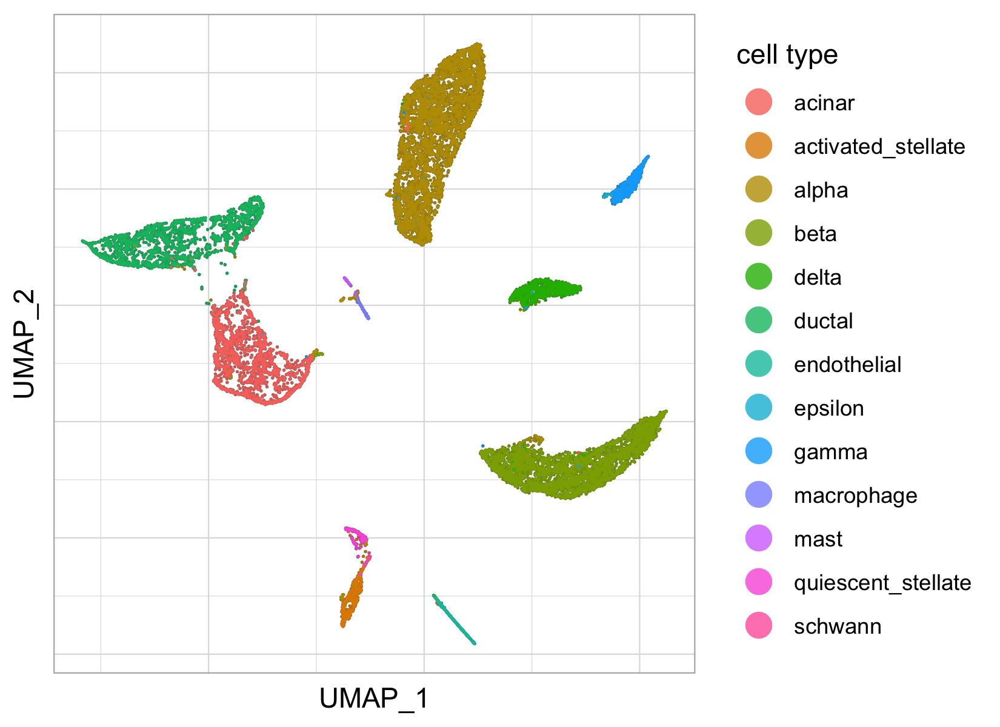
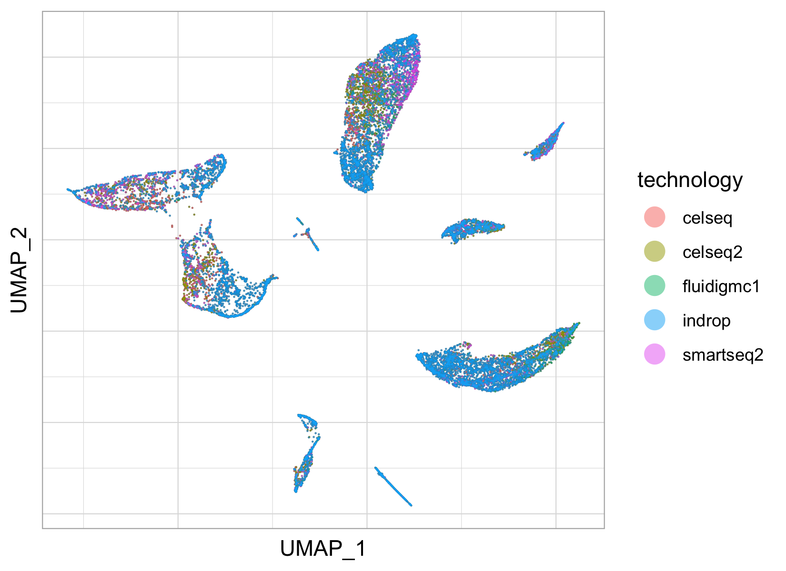
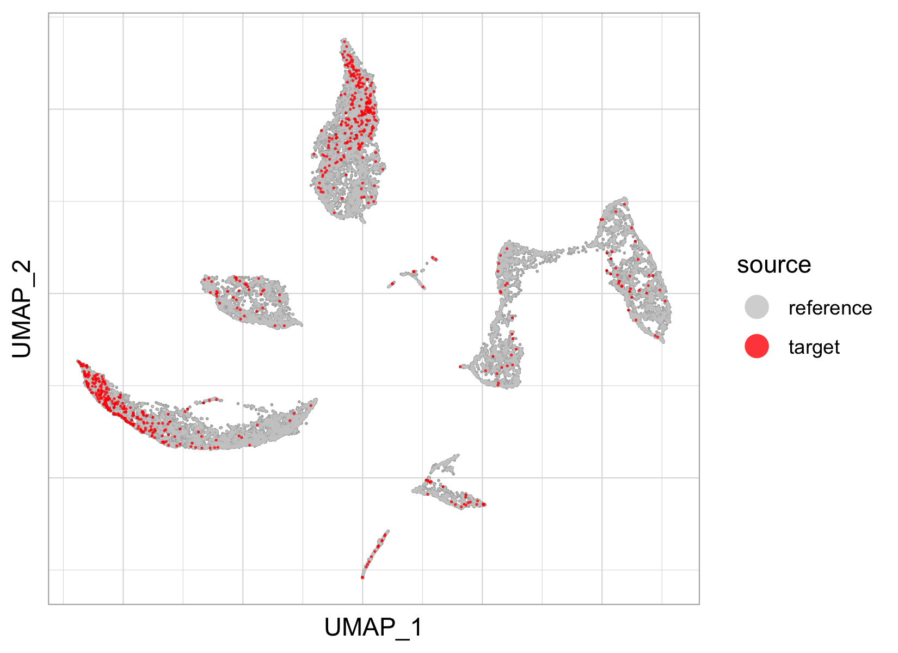
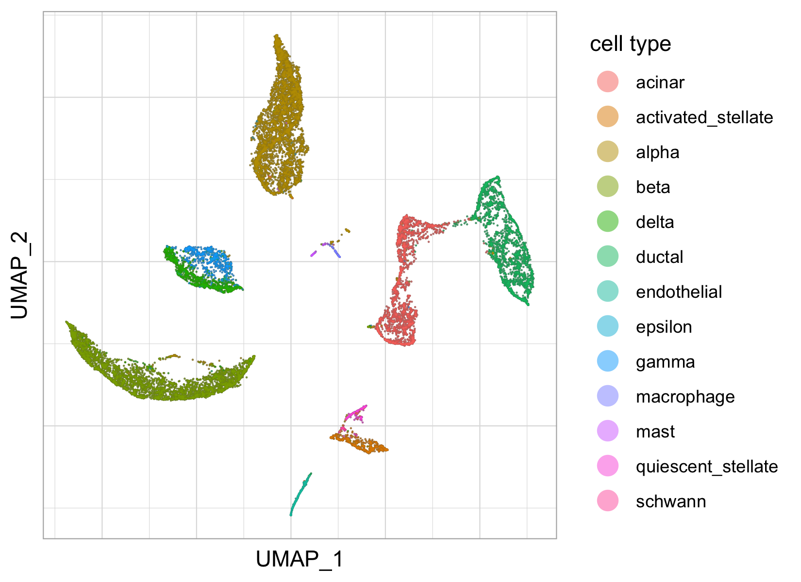
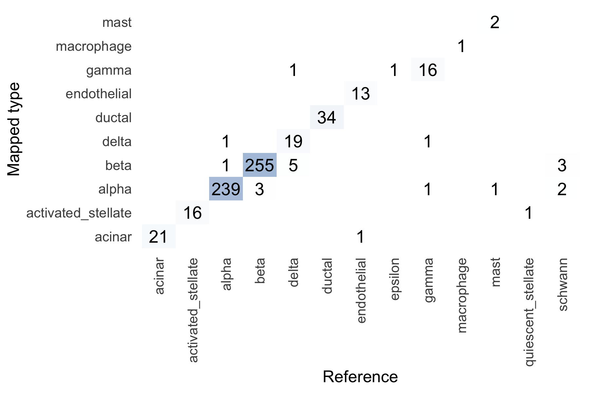
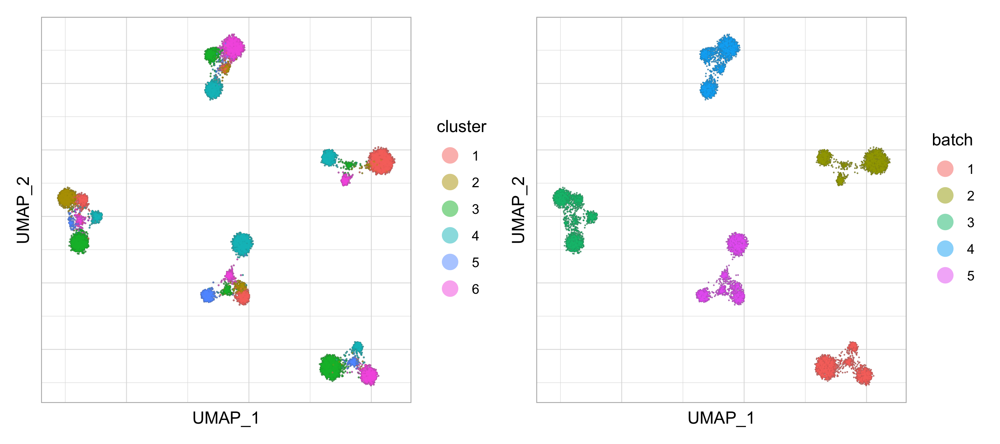
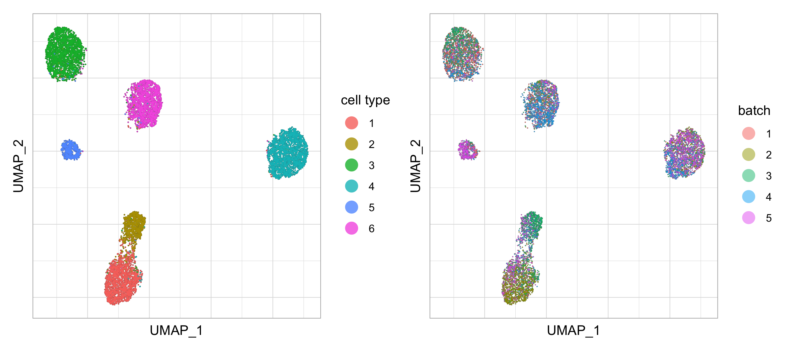

```{css, echo=FALSE}
pre code {
white-space: pre !important;
overflow-x: scroll !important;
word-break: keep-all !important;
word-wrap: initial !important;
}
```

```{r, include = FALSE}
knitr::opts_chunk$set(collapse = TRUE, comment = "#>",
                      echo=TRUE, message=FALSE, warnings=FALSE
                      )
```


# Introduction

cFIT (common Factor Space Integration & Transfer) is a tool for data integration and transfer for scRNAseq data. It is applied to data from multiple labs and experimental conditions, technologies and even species.

Our proposed method models the shared information between various data sets by a common factor space, while allowing for unique distortions and shift per batch. The model parameters are learned under and iterative non-negative matrix factorization (NMF) framework and then used for synchronized intefration from across-domain assays. In addtion, the model enables transferring via low-rank matrix from more informative data to allow for precise identification of data of lower quality.

# Getting started

First load the package
```{r, eval=F}
library(cFIT)
```

We illustrate the standard workflow of data integration as well as data transfer, using well analyzed pancreas islet cells dara sets, retrieved from `SeuratData` package (@stuart2019comprehensive).

```{r, eval=F}
library(SeuratData)
data("panc8")
```

## Data integration

cFIT integration is composed of the following procedure:

* Gene selection. Select highly variable genes that are shared among data sources. Here we adopt the proposed procedure from [Seurat V3](https://satijalab.org/seurat/).
* Data preprocessing. Library size normalization and log transformation
* Model parameter estimation. The model parameters are estimated throught iterative NMF
* Post processing, evaluation, and downstream analysis.


The `panc8` is saved as Seurat object, we extract the raw expression and cell metadata.
```{r, eval=F}
# extract the raw counts and metadata for data sets from 5 technologies
data.list = split_dataset_by_batch(X=t(as.matrix(panc8@assays$RNA@counts)), 
                                   batch = panc8@meta.data$tech, 
                                   labels = panc8@meta.data$celltype, 
                                   metadata = panc8@meta.data, 
                                   dataset.name = 'panc:')

```

Select 2000 highly variable genes
```{r, eval=F}
# select highly variable genes
genes = select_genes(data.list$X.list, ngenes=2000, verbose=F)
```

Preprocess to normalize by library size and log transform
```{r,  eval=F}
# data preprocessing
exprs.list = preprocess_for_integration(data.list$X.list, genes, scale.factor=10^4, scale=T, center=F)
```

Perform data integration with `CFITIntegrate`. The only parameter to adjust is `r`, which is the number of factors of the common factor matrix (shared across datasets). The algorithm is relatively robust to `r` as long as r approximate the number of underlying distinct cell types across all data sets. Other minor parameters that can be adjusted is `max.niter` (100 by default), `tol` tolerance used in stopping criteria (1e-5 by default), `gamma` tunning of the penalty term (1e6 by default), `nrep` number of repeats of the run (1 by default, require much longer if increased), `init` parameter initialization (NULL).

```{r, eval=F}
# takes roughly 20 minutes to run
int.out = CFITIntegrate(X.list=exprs.list, r=15, verbose=T, seed=0)
saveRDS(int.out, file='results/panc5_integration_output.rds') # /Users/minshipeng/Dropbox/research/cFIT/cFIT/vignettes/
```

```{r, echo=F,  eval=F}
int.out = readRDS('results/panc5_integration_output.rds')
```

The output is a list containing

* estimated model parameters, common factor matrix `W`, factor loading matrices (per datasets) `H.list`, dataset specific scaling `lambda.list` and shift `b.list`
* convergence status `convergence`, number of iterations `niter`, and final objective function value `obj`, final objective delta `delta`
* parameters used for the function call, including `gamma`, `max.iter`, `tol`, `rep`

We obtain the integrated data via
```{r,  eval=F}
# ncell-by-ngene expression matrix
exprs.int = do.call(rbind, int.out$H.list) %*% t(int.out$W)

# ncell-by-r low dimensiional representation
Hnorm = do.call(rbind, int.out$H.list) %*% diag(colSums(int.out$W))
```


Visualize the integrated data via UMAP plot,
```{r, eval=F, fig.width=5, fig.height=4,fig.align='center',fig.show="hold",out.width="50%", fig.cap='Integrated pancreas islet cells data sests from five technologies.'}
tech = do.call(c, lapply(data.list$metadata.list, function(x) x$tech))
celltype = do.call(c, data.list$labels.list)
umap.out = plot_umap(X=Hnorm, labels=celltype, 
                     pca = NULL, n_components = 2, n_neighbors = 50, min_dist = 0.1, # umap parameters
                     point.size = 0.6, alpha=0.8, title=NULL, legend.name='cell type', # figure parameters
                     seed=42)

p1 = umap.out$p # colored by technologies
p2 = plot_umap(labels=tech, point.size = 0.5, alpha=0.5, legend.name='technology', emb=umap.out$emb)$p # colored by cell types
p1
p2
```


```{r, echo=F, fig.show="hold", fig.cap = 'Integrated pancreas islet cells data sests from five technologies.'}
# ggsave('fig/panc_int_umap_color_tech.png', plot=p1, width=5.5, height=4)
# ggsave('fig/panc_int_umap_color_celltype.png', plot=p2, width=5.5, height=4)



```

Calculate the alignment score for each datasets

```{r, eval=F}
alignment.score.out = calculate_alignment(X.list=list(Hnorm), k=30, balanced=F, dataset=tech, labels=celltype)
# alignment.score.out$alignment.per.dataset
#     celseq    celseq2 fluidigmc1     indrop  smartseq2 
#  0.8175777  0.7089732  0.8483672  0.6431162  0.7169563 
```


```{r, echo=F, eval=F}
rm(data.list, genes,exprs.list,int.out)
```

## Data transfer

We first integrate data sets from four technologies (inDrop, celseq, celseq2, SmartSeq2), and then transfer the learned factor matrix to the smallest dataset--fluidigmc1, which is from a very different technology from the other seven source data sets.


```{r, eval=F}
# perform integration to estimate Wref with data sets from 4 technologies
# run time 20 min
int.ref.out = CFITIntegrate(X.list=exprs.list[c(1,2,3,5)], r=15, verbose=T, seed=42)
saveRDS(int.ref.out, file='results/panc_ref_integration_output.rds') 
```

The learned common factor matrix, saved in `int.ref.out` is then transfer to the smallest data set, containing 638 cells from fluidigmc1 technology.

```{r, eval=F}
# transfer: run time 10 seconds
tf.out = CFITTransfer(Xtarget=exprs.list[[4]], Wref=int.ref.out$W, seed=0, verbose=F)
```

Visualize the transferred results via UMAP plot,
```{r, eval=F, fig.width=5, fig.height=3.5,fig.align='center',fig.show="hold",out.width="50%", fig.cap='cFIT transfer results.'}
Hnorm = rbind(do.call(rbind, int.ref.out$H.list), tf.out$H) %*% diag(colSums(int.ref.out$W))
source = rep(c('reference','target'), c(nrow(do.call(rbind, int.ref.out$H.list)), nrow(tf.out$H)))
celltype = do.call(c, c(data.list$labels.list[c(1,2,3,5)],data.list$labels.list[4]))

umap.out = plot_umap(X=Hnorm, labels=source, min_dist = 0.1, # umap parameters
                     point.size = 0.6, alpha=0.8, title=NULL, legend.name='source', 
                     cols=c('grey80','red'), seed=0)

p1 = umap.out$p # colored by source
p2 = plot_umap(labels=celltype, point.size = 0.5, alpha=0.5, legend.name='cell type',  
               emb=umap.out$emb)$p # colored by cell types
p1+p2
```

```{r, echo=F, fig.show="hold", fig.cap='cFIT transfer results.'}
# , fig.show="hold",out.width="50%"
# ggsave('fig/panc_transfer_umap_color_source.png', plot=p1, width=5.5, height=4)
# ggsave('fig/panc_transfer_umap_color_celltype.png', plot=p2, width=5.5, height=4)



```

Assign labels for each cell in the target data by querying the cell type of target cells within k nearest neighbors.

```{r, eval=F}
est.labels = asign_labels(exprs.source=do.call(rbind, int.ref.out$H.list), 
                           exprs.target=tf.out$H, 
                           labels.source=do.call(c, data.list$labels.list[c(1,2,3,5)]))
plotContTable(est_label=est.labels, true_label=data.list$labels.list[[4]], ylab='Mapped type')
```

```{r, echo=F,  fig.align='center', fig.cap='Confution matrix comparing the mapped cell type with the reference labels'}
# ggsave('fig/panc_transfer_confusion_matrix.png', width = 6, height=4)

```

# Simulation

We provide tools for simulating data sets. The data can be generated either from our proposed model, or from models provided by a widely employed scRNAseq data simulator [Splatter](https://github.com/Oshlack/splatter) package (@zappia2017splatter)


## Simulate from assumed model

Here we show an example of simulating 5 datasets (`ntask`), each composed of 2000 samples (`n`), 500 features (`p`), from 8 underlying clusters (`K`). The cluster separation in controled by the parameter `cl.seq`, and the batch distinction is determined by `batch.effect.sig`, and the within cluster variance is controled by `sig`. `alpha` determines the group proportion, where a smaller alpha corresponds to more unbalanced datasets. 

```{r, eval=F}
data.out = generate_data(n=2000, p=500, ntask=5, K=6, cl.sep=1, sig=1, batch.effect.sig=1, alpha=0.5)
```


where the ouput contains all the simulated expression matrix saved in a list `X.list` and all the model parameters `W`, `H.list`, `lambda.list`, `b.list`. We can see the the simulated data is grouped by both cluster and batch.

```{r, eval=F}
labels = as.character(do.call(c, data.out$label.list))
batchs = as.character(rep(1:length(data.out$X.list), each=length(data.out$label.list[[1]])))

umap.out = plot_umap(X=do.call(rbind, data.out$X.list), labels=labels, 
                     min_dist = 0.4, point.size = 0.6, alpha = 0.5, legend.name = 'cluster')
p1 = umap.out$p 
p2 = plot_umap(labels=batchs, point.size = 0.5, alpha=0.5, legend.name='batch',  emb=umap.out$emb)$p

p1+p2
```

```{r, echo=F, fig.align='center', fig.cap='Simulated data from assumed model.'}
# ggsave('fig/simu_model_raw.png', plot=p1+p2, width = 9, height=4)

```

By cFIT we get the integrated results

```{r, eval=F}
int.out = int.ref.out = CFITIntegrate(X.list=data.out$X.list, r=6, verbose=T, tol=5e-5, seed=42) 
saveRDS(int.ref.out, file='results/simu_model_integration_output.rds') 
```

```{r, eval=F, fig.width=5, fig.height=4,fig.align='center',fig.show="hold",out.width="50%", fig.cap='Simulated data from assumed model with batch effects corrected applying cFIT.'}
Hnorm = do.call(rbind, int.out$H.list) %*% diag(colSums(int.out$W))
umap.out = plot_umap(X=Hnorm, labels=labels, point.size = 0.5, alpha=0., legend.name='cell type')

p1 = umap.out$p # colored by technologies
p2 = plot_umap(labels=batchs, point.size = 0.5, alpha=0.5, legend.name='batch', emb=umap.out$emb)$p # colored by cell types
p1+p2
```

```{r, echo=F, fig.align='center',  fig.cap='Simulated data from assumed model with batch effects corrected applying cFIT.'}
# ggsave('fig/simu_model_int_out.png', plot=p1+p2, width = 9, height=4)

```

## Simulated single cell datasets

More details to add ...


# Version Information

```{r sessionInfo}
sessionInfo()
```

# Reference


